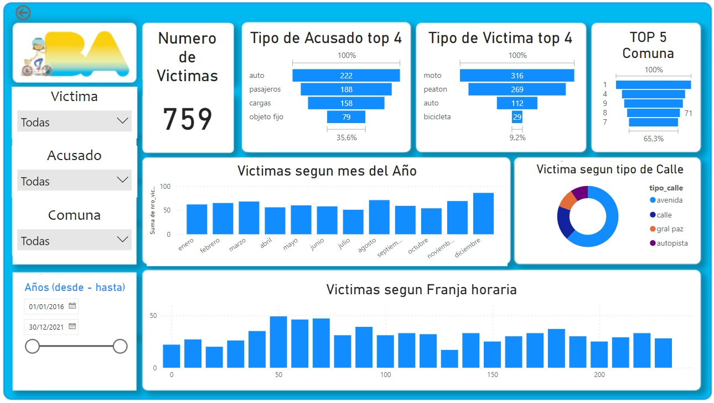
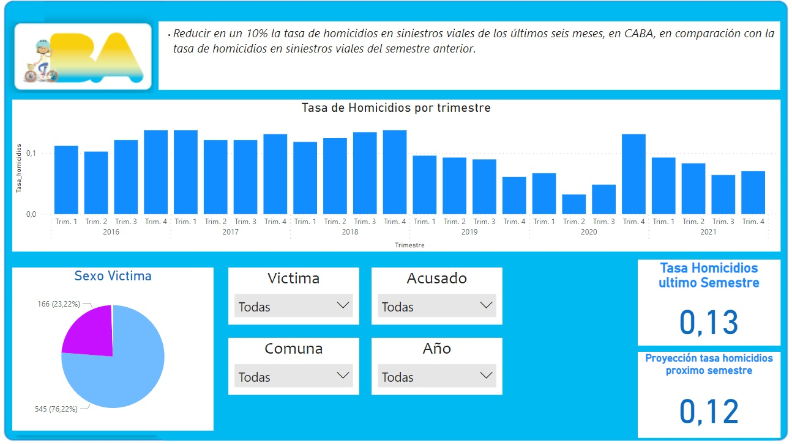
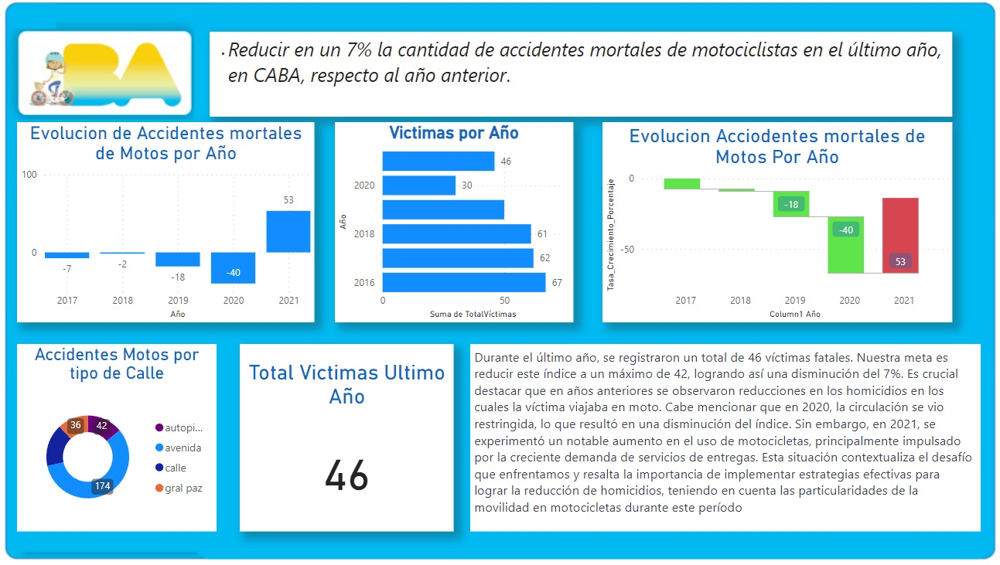
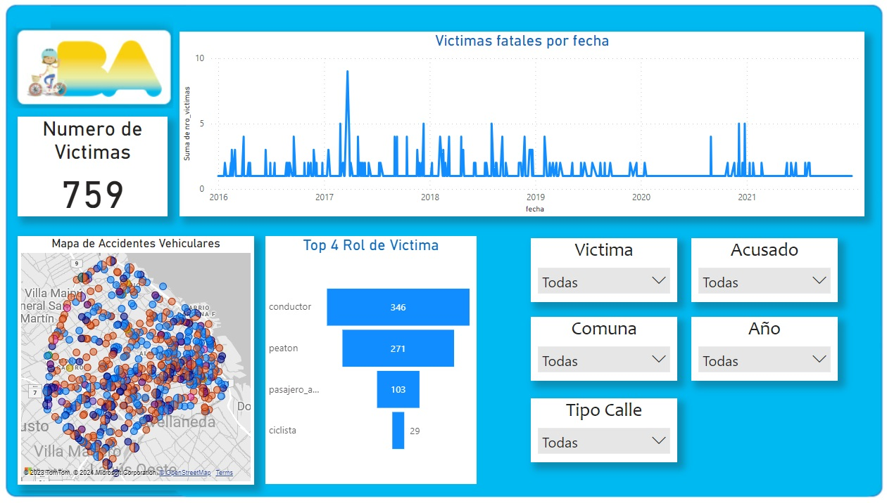

<h1 align='center'>
 <b>PROYECTO INDIVIDUAL Nº2</b>
</h1>
# <h1 align="center">**`Siniestros viales`**</h1>

## **Descripción del problema -contexto y rol a desarrollar-**
Los siniestros viales, también conocidos como accidentes de tráfico o accidentes de tránsito, son eventos que involucran vehículos en las vías públicas y que pueden tener diversas causas, como colisiones entre automóviles, motocicletas, bicicletas o peatones, atropellos, choques con objetos fijos o caídas de vehículos. Estos incidentes pueden tener consecuencias que van desde daños materiales hasta lesiones graves o fatales para los involucrados.

En el contexto de una ciudad como Buenos Aires, los siniestros viales pueden ser una preocupación importante debido al alto volumen de tráfico y la densidad poblacional. Estos incidentes pueden tener un impacto significativo en la seguridad de los residentes y visitantes de la ciudad, así como en la infraestructura vial y los servicios de emergencia.

Las tasas de mortalidad relacionadas con siniestros viales suelen ser un indicador crítico de la seguridad vial en una región. Estas tasas se calculan, generalmente, como el número de muertes por cada cierto número de habitantes o por cada cierta cantidad de vehículos registrados. Reducir estas tasas es un objetivo clave para mejorar la seguridad vial y proteger la vida de las personas en la ciudad.

Es importante destacar que la prevención de siniestros viales involucra medidas como la educación vial, el cumplimiento de las normas de tráfico, la infraestructura segura de carreteras y calles, así como la promoción de vehículos más seguros. El seguimiento de las estadísticas y la implementación de políticas efectivas son esenciales para abordar este problema de manera adecuada.
# ETL
### Fuente de datos
- [Buenos Aires Data](https://data.buenosaires.gob.ar/dataset/victimas-siniestros-viales): deberán utilizar el dataset denominado `Homicidios`
Realizo la extraccion de datos como detallo en [Notebook ETL](ETL.ipynb) donde encontramos un archivo de excel con datos en deversas pestañas donde se destacan la hola hechos y la hoja victimas las cuales nos serviran para realizar nuestro proyecto
Una vez abanzado el proyecto veo que hay datos faltantes para realizar las consultas solicitadas este dato que nos falta es la cantidad de habitantes , realizamos una investigacion y como en argentina se realizan los sensos cada 10 años tenemos datos de los habitantes por comuna del 2010 y del 2022 siendo este ultimo el que usaremos para la exploracion de los datos estos datos son provenientes de [Indec](https://www.indec.gob.ar/indec/web/Nivel4-Tema-2-41-165)

# EDA
 - Se realizo EDa segun como detallo [Notebook EDA](EDA.ipynb) , previamente cuando se hizo la extraccion de los datos se analizo y se descartaron varias columnas que daban a entender redundancia, mientras que en esta instancia nos enfocamos en reducir los datos faltantes o rellenarlos por ejemplo en donde faltaban datos de longitud y latitud pero teniamos los datos sobre a cual comuna se referia se opto por hacer un df con el promedio de hubicacion para cada comuna y asi en donde teniamos faltanes que solo eran unos pocos se relleno con esos datos, para la exploracion del archivo con la poblacion por comuna al ser un archivo muy simple solo se abrio y se observo en una pagina de excel ya que solo era una tabla de muy pocos elementos

# Visualizacion de datos en PowerBi

 - Una vez ingresados los archivos homicidios_cleaned.cvs y poblacion_por_comuna.xlsx se visualizaron en transformacion de datos de power bi para revision y realizar una instancia mas de correccion de datos

 realizando los distintos dashboar

  

Autor
- Roman Brandariz
mail branr0@hotmail.com
[Linkedin](https://www.linkedin.com/in/romanbrandariz/)

